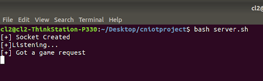
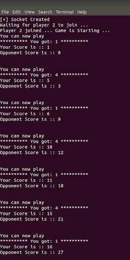
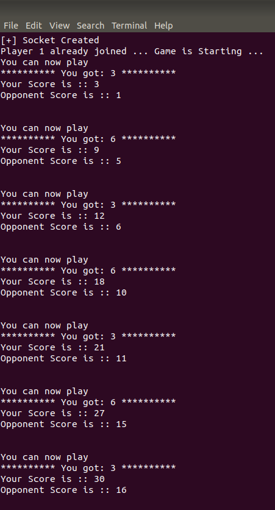

# SocketDice: Networked Dice Game Adventure

Welcome to **SocketDice**, a multiplayer dice game that brings the concepts of Computer Networks (CN) and the Internet of Things (IoT) into a fun and interactive gaming experience! This project is designed to help you understand the fundamentals of networking, client-server communication, and concurrency in a hands-on, engaging way. If you've ever wondered how applications communicate over a network, this game will give you a practical and enjoyable insight into the magic that happens behind the scenes.

## 🧠 **Why This Project Matters**

Networking is the backbone of modern applications. From chat applications to online gaming, understanding how data travels between devices is crucial for any aspiring computer scientist or developer. **SocketDice** provides a window into this world by demonstrating how multiple players can connect over a network, communicate through messages, and interact in real-time using socket programming.

By implementing this project, you'll gain valuable experience with:
- Client-server architecture
- Concurrency and multi-threading
- Real-time message passing
- The practical application of socket programming

Through this game, you’ll learn not just the technical concepts, but also how they come together to create a seamless interactive experience.

---

## 🎯 **Project Objectives**

The main objectives of this project are to:
1. **Implement a multiplayer dice game** using socket programming in C, showcasing the concept of client-server communication over a network.
2. **Demonstrate client-server architecture** where the server manages the game logic and the clients act as players.
3. **Utilize concurrency** to handle multiple client connections, allowing the server to manage multiple game sessions simultaneously.
4. Provide a **hands-on understanding of networking concepts** such as sockets, message passing, and bidirectional data transfer.

---

## 🔍 **Simulation Example**

### How It Works

1. **Server Start-Up**: The server starts and waits for incoming client connections.
2. **Client Connection**: Two clients (players) connect to the server.
3. **Gameplay**: The server alternates turns between the two clients, allowing them to roll a dice and accumulate their scores.
4. **Winning the Game**: The first player to reach a total score of 100 is declared the winner, and the server ends the game.

### Example Steps with Screenshots

**Step 1: Server Waiting for Clients**

The server starts and waits for clients to connect.

Two clients, Player 1 (TOTO) and Player 2 (TITI), connect to the server.

**Step 2: Gameplay Begins**

The server sends the "You can now play" message to Player 1. Player 1 rolls the dice, and the score is sent back to the server.

(Extras/player1_playing2.png)

Next, it's Player 2's turn. The server sends the "You can now play" message to Player 2, and Player 2 rolls the dice.

(Extras/player2_playing2.png)

Once a player reaches a score of 100, the server declares the winner. In this example, Player 2 wins the game.

---

## ⚙️ **Built With**

- **Programming Language**: C
- **Networking Libraries**: Socket Programming APIs
- **Development Environment**: Linux/Unix Terminal
- **Concurrency Tools**: Forking and threading for handling multiple clients

---

## 👩‍💻 **Author**

- **Khushi Goel** - [GitHub Profile](https://github.com/Khushigoel14)

---

## 🙌 **Acknowledgments**

A special thanks to:
- Our instructors and mentors for their guidance on networking concepts.
- Open-source communities and forums for providing valuable resources on socket programming.
- The creators of C language and Unix for making such projects possible.

This project wouldn’t be complete without the support and collaboration of everyone involved. We hope that you enjoy playing and learning with **SocketDice** as much as we enjoyed building it!

Feel free to fork this repository, experiment, and even improve upon it. Happy coding and may the best player win! 🎲

---

**Note**: To run this project, you'll need a Linux/Unix environment with GCC installed. Follow the instructions in the `setup_instructions.md` file for detailed steps on how to compile and execute the server and client programs.
